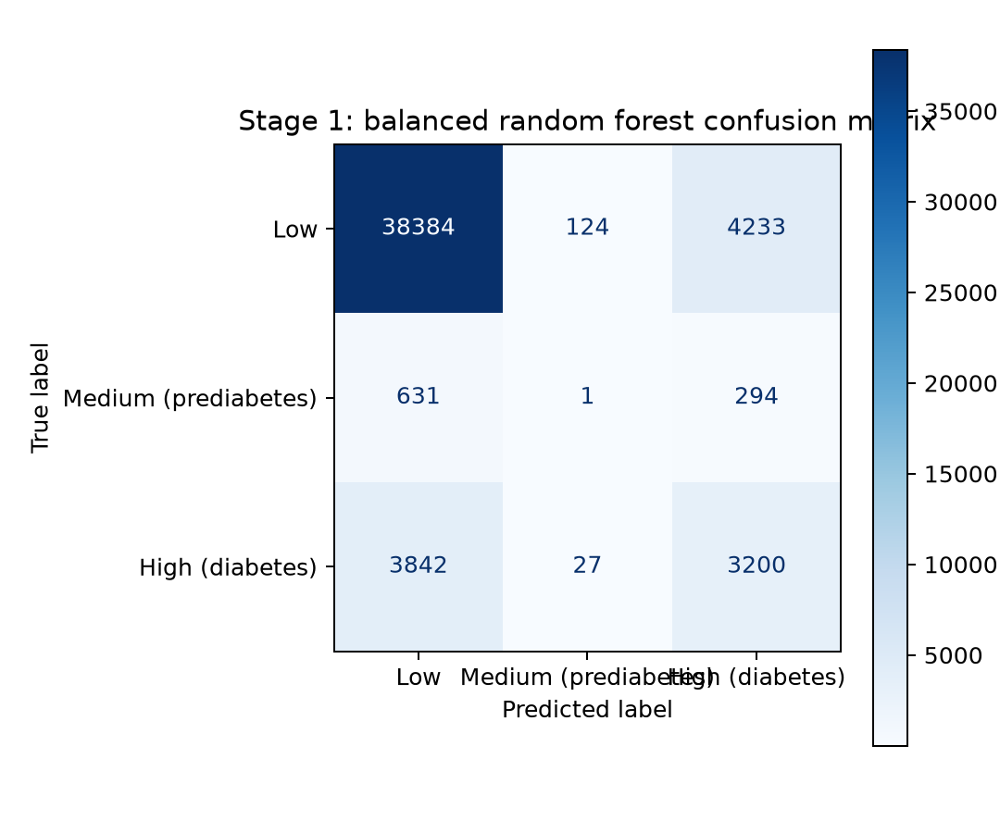
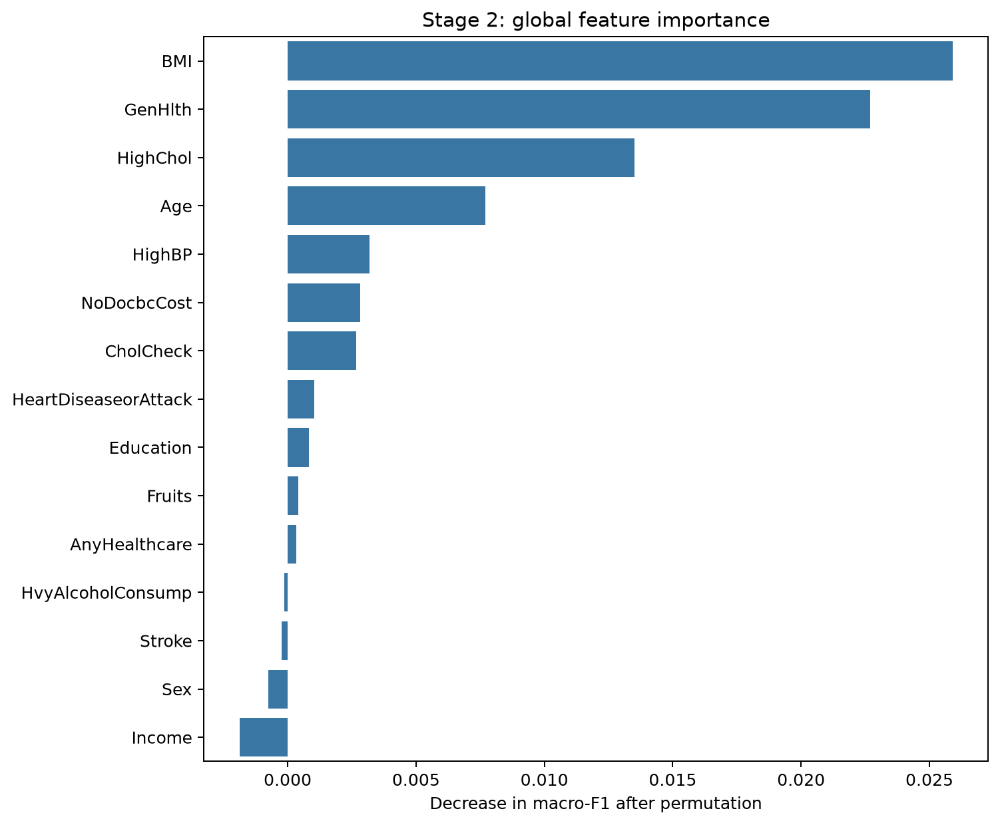
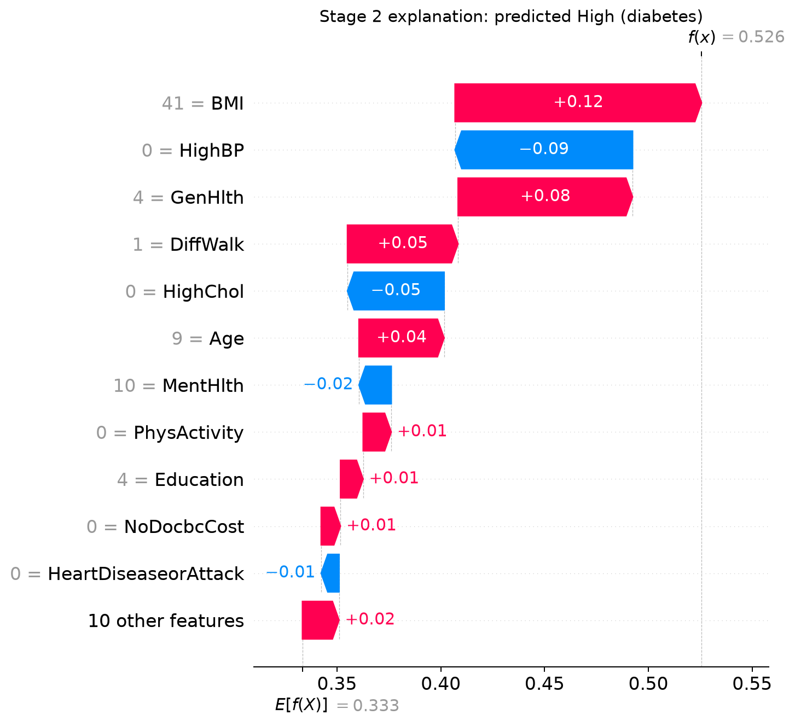

# An Explainable Diabetes-Risk Digital Twin: Four Stage-Wise Experiments on BRFSS Survey Data

## Abstract

Machine-learning models can estimate diabetes-related survey labels, but a useful research prototype must also expose model evidence, support transparent scenario analysis, and communicate limitations. This report evaluates an explainable diabetes-risk Digital Twin as four linked experiments: three-class prediction, global and patient-level explanation, manual what-if simulation with a 3D representation, and knowledge-graph-based evidence integration with constrained local-language-model guidance. A 400-tree class-weighted Random Forest was trained on 253,680 CDC BRFSS 2015 records using 21 features and a stratified 80/20 split. The model achieved 81.96% accuracy, 45.06% balanced accuracy, 44.37% macro-F1, and 0.758 macro one-vs-rest ROC-AUC; however, Medium/prediabetes recall was only 0.11%. In a held-out High/diabetes case, BMI and general health supplied the largest positive SHAP contributions. Manually changing BMI from 41 to 36 and physical activity from 0 to 1 reduced the model's High/diabetes probability from 56.69% to 37.68%, a 19.01 percentage-point change that must not be interpreted causally. Stage 4 preserved all 21 observations, 21 SHAP contributions, and three class probabilities in a temporary 98-node, 135-edge patient graph, while 22 focused implementation tests passed. The results establish technical feasibility for an evidence-oriented research prototype, but not clinical validity, causal intervention effects, or suitability for screening.

## 1. Introduction

Diabetes-risk modelling is a useful test case for studying how prediction, explanation, simulation, and semantic evidence can be combined in one human-readable system. The implemented prototype uses the CDC Diabetes Health Indicators data derived from BRFSS 2015. The dataset contains 253,680 survey records, 21 model features, and a three-class target representing no diabetes, prediabetes, and diabetes [1]. Because these observations are cross-sectional and self-reported, they can support predictive association studies but cannot establish intervention effects.

The research problem is broader than maximizing accuracy. A model may report a plausible overall score while performing poorly for a minority class, and a patient-level explanation can be misread as a medical cause. Similarly, a what-if interface can be mistaken for a treatment simulator if edited inputs and model outputs are described causally. This study therefore evaluates not only prediction quality, but also whether the system preserves complete model evidence and maintains an explicit research-only boundary.

The implemented project differs materially from the early four-page proposal stored in the repository. The proposal anticipated longitudinal ShanghaiT2DM data, HbA1c and continuous-glucose-monitoring variables, and automatic clinical intervention generation. The current implementation instead uses BRFSS 2015 survey data, excludes physiological mechanism chains, treats Stage 3 changes as manual model re-prediction, and restricts Stage 4 language generation to validated evidence references. This report describes the implemented system rather than the earlier intended system.

The study makes three contributions:

1. It evaluates one end-to-end prototype through four stage-specific experiments, so each added capability has a separate research question, method, result, and limitation.
2. It combines global permutation importance with patient-specific SHAP values while retaining the distinction between population-level feature relevance and local model contribution.
3. It implements a complete 21-feature evidence contract for temporary patient graphs and constrains local-model output so that unvalidated clinical or causal prose is not rendered directly.

## 2. Research Questions

| Stage | Experiment | Research question | Evidence produced |
| --- | --- | --- | --- |
| 1 | Three-class prediction | RQ1: How well can a class-weighted Random Forest distinguish Low, Medium/prediabetes, and High/diabetes BRFSS labels? | Held-out classification metrics, confusion matrix, and one-vs-rest ROC curves |
| 2 | Model explanation | RQ2: Which variables are most relevant globally, and which variables support or oppose one held-out patient's predicted class? | Permutation importance and patient-level SHAP values |
| 3 | Manual Digital Twin scenario | RQ3: Can the same fitted model and 3D representation produce a transparent before/after result when selected survey inputs are manually edited? | Current-versus-scenario probabilities and twin descriptors |
| 4 | Knowledge-graph evidence integration | RQ4: Can the system organize complete patient-specific model evidence and produce constrained local guidance without persisting patient data or asserting clinical causality? | Graph completeness, fallback behavior, safety checks, and implementation tests |

## 3. Related Work

### 3.1 Random forests for tabular classification

Random forests combine randomized decision trees and aggregate their predictions, providing a practical baseline for heterogeneous tabular variables [2]. The Training3 implementation uses this family because BRFSS contains a mixture of binary, ordinal, and continuous survey indicators. Unlike a benchmark study comparing multiple model families, this work evaluates one fixed Random Forest as the prediction core of a broader explainability and Digital Twin pipeline.

### 3.2 Feature attribution and SHAP

SHAP represents a prediction as additive feature contributions and was introduced as a unified framework for local model interpretation [3]. This study uses exact TreeExplainer values for the selected patient's predicted class. SHAP signs are described as model support or opposition, not as protective or harmful medical effects. Global permutation importance is evaluated separately because it measures held-out performance degradation after feature shuffling rather than explaining one prediction.

### 3.3 Digital Twins and patient knowledge graphs

Healthcare Digital Twins are commonly associated with patient-specific representations, iterative data updates, and simulation, but reviews also identify gaps in model fidelity and clinical validation [4]. Architectures combining Digital Twins with personal knowledge graphs have been proposed to support patient-centred data integration [5]. The present system is deliberately narrower: it is a research prototype driven by a static survey row, a predictive model, and manual scenarios. Its knowledge graph represents observations and model evidence; it does not encode verified disease mechanisms or prescribe interventions.

## 4. Shared Methodology

### 4.1 Dataset and preprocessing

The experiment uses `diabetes_012_health_indicators_BRFSS2015.csv`. The target `Diabetes_012` is retained as three classes: 0 = Low, 1 = Medium/prediabetes, and 2 = High/diabetes. The 21 input variables are HighBP, HighChol, CholCheck, BMI, Smoker, Stroke, HeartDiseaseorAttack, PhysActivity, Fruits, Veggies, HvyAlcoholConsump, AnyHealthcare, NoDocbcCost, GenHlth, MentHlth, PhysHlth, DiffWalk, Sex, Age, Education, and Income.

After numeric conversion and complete-case filtering, 253,680 records remained. The class distribution was strongly imbalanced: 213,703 Low records (84.24%), 4,631 Medium records (1.83%), and 35,346 High records (13.93%). A stratified split with `random_state=42` assigned 202,944 records to training and 50,736 to testing.

### 4.2 Prediction model

The model is a `RandomForestClassifier` with 400 trees, `class_weight='balanced_subsample'`, `min_samples_leaf=2`, full CPU parallelism, and random seed 42. Balanced subsample weighting increases the influence of minority-class observations within each tree's bootstrap sample without synthesizing new patient records. The evaluation reports accuracy, balanced accuracy, macro-F1, weighted F1, per-class precision/recall/F1, and macro one-vs-rest ROC-AUC.

### 4.3 Integrated prototype

The trained model, exact SHAP computation, scenario comparison, temporary knowledge graph, and optional 3D SMPL assets are exposed through a local Flask dashboard. Docker Compose defines separate dashboard, Neo4j, Jupyter, notebook-execution, and SMPL-export services. Patient observations, predictions, and SHAP values are assembled in memory for the current request; only reusable definitions are stored in Neo4j. Local Ollama integration accepts complete structured evidence, returns only selected feature and topic identifiers, and is followed by server-side validation and deterministic prose rendering.

## 5. Experiment 1: Three-Class Prediction

### 5.1 Objective and setup

Experiment 1 evaluates whether the fixed Random Forest can distinguish all three BRFSS target classes on the held-out split. Macro-F1 and balanced accuracy are the primary metrics because the Low class accounts for more than four-fifths of the dataset.

### 5.2 Results

| Metric | Result |
| --- | ---: |
| Accuracy | 0.8196 |
| Balanced accuracy | 0.4506 |
| Macro-F1 | 0.4437 |
| Weighted F1 | 0.8158 |
| Macro one-vs-rest ROC-AUC | 0.7582 |

| Class | Precision | Recall | F1 | Test support |
| --- | ---: | ---: | ---: | ---: |
| Low | 0.8956 | 0.8981 | 0.8968 | 42,741 |
| Medium/prediabetes | 0.0066 | 0.0011 | 0.0019 | 926 |
| High/diabetes | 0.4141 | 0.4527 | 0.4325 | 7,069 |



The confusion matrix shows that the model correctly classified 38,384 Low records, one Medium record, and 3,200 High records. The per-class ROC-AUC values were 0.811 for Low, 0.647 for Medium, and 0.817 for High. These discrimination scores do not offset the operating-point failure for Medium/prediabetes: 925 of 926 Medium records were missed.

### 5.3 Answer to RQ1

RQ1 is only partially supported. The model provides useful discrimination for Low and High labels, but it does not reliably identify Medium/prediabetes records. Overall accuracy must therefore not be presented as evidence of balanced three-class performance or screening readiness.

## 6. Experiment 2: Global and Patient-Level Explanation

### 6.1 Objective and setup

Experiment 2 separates two explanation questions. Global permutation importance measures the decrease in held-out macro-F1 after one feature is shuffled. To bound memory and runtime, the notebook uses 1,000 held-out records, three repeats, one outer worker, and seed 42. Patient-level explanation uses exact TreeExplainer SHAP values for the class predicted for one held-out High/diabetes record.

### 6.2 Global results

The leading global features were GenHlth (mean macro-F1 decrease 0.0458), BMI (0.0415), HighBP (0.0307), Age (0.0259), and HighChol (0.0129). HeartDiseaseorAttack ranked sixth at 0.0100. Negative or near-zero permutation values for lower-ranked variables should be treated as sampling variation, correlation effects, or limited usefulness under this fitted model, not evidence that the variables are medically protective.



### 6.3 Patient-level results

The selected held-out record is dataset patient 104,917. Its recorded and predicted classes were both High/diabetes, and its predicted High/diabetes probability was 56.69%. The largest positive contributions to the predicted class were BMI = 41 (SHAP +0.1200), GenHlth = 4 (+0.0874), DiffWalk = 1 (+0.0616), Age = 9 (+0.0386), and PhysActivity = 0 (+0.0205). The largest negative contributions were HighBP = 0 (-0.0778), HighChol = 0 (-0.0422), and MentHlth = 10 (-0.0186).



### 6.4 Answer to RQ2

RQ2 is supported as a model-explanation question. The experiment identifies which variables affected held-out macro-F1 globally and which recorded values supported or opposed one local prediction. It does not show that changing any feature would cause diabetes risk to change.

## 7. Experiment 3: Manual What-If Digital Twin Scenario

### 7.1 Objective and setup

Experiment 3 tests engineering consistency across model re-prediction, scenario comparison, and 3D twin descriptors. The baseline is the same held-out patient used in Experiment 2. A transparent manual scenario changes only BMI from 41 to 36 and PhysActivity from 0 to 1; all other 19 features remain fixed. The fitted model is then run again without retraining.

The 3D descriptor maps Sex to the available male/female SMPL model, maps BMI to the first shape coefficient using `(BMI - 22) x 0.5`, and maps High/diabetes probability to a display colour. These mappings are visualization rules, not physiological models.

### 7.2 Results

| Quantity | Current patient | Manual scenario | Change |
| --- | ---: | ---: | ---: |
| BMI | 41.0 | 36.0 | -5.0 |
| PhysActivity | 0 | 1 | +1 |
| High/diabetes probability | 56.69% | 37.68% | -19.01 percentage points |
| Display band | Moderate | Low | Descriptive UI change |
| SMPL beta 0 | 9.5 | 7.0 | -2.5 |

The scenario generated a lower model estimate and a separately parameterized twin descriptor. The result demonstrates deterministic propagation from edited inputs to model output and visualization. It does not estimate the effect of weight loss or physical activity on an individual patient because the model is fitted to cross-sectional associations and the two inputs were changed simultaneously.

### 7.3 Answer to RQ3

RQ3 is supported only as a transparent model what-if experiment. The system can compare model outputs under manually edited inputs and regenerate linked visual descriptors. It cannot claim intervention efficacy, temporal disease progression, or counterfactual causality.

## 8. Experiment 4: Knowledge-Graph Evidence Integration

### 8.1 Objective and setup

Experiment 4 evaluates completeness, persistence boundaries, fallback behavior, and language-generation safety. The graph includes a temporary patient snapshot, six domains, all 21 observations, reusable attribute definitions, decoded states, all 21 SHAP contributions, a prediction node, three probability nodes, model and evaluation nodes, and one Digital Twin representation node. Patient-specific nodes are assembled in memory and are not written to Neo4j.

Each SHAP contribution receives one of three explicit relations to the class-2 High/diabetes probability: `INCREASES_MODEL_HIGH_RISK_ESTIMATE`, `DECREASES_MODEL_HIGH_RISK_ESTIMATE`, or `NEUTRAL_FOR_MODEL_HIGH_RISK_ESTIMATE`. The graph removes earlier prototype nodes such as the 3D Digital Twin, Insulin Resistance, and Increased T2DM Risk because they do not belong in the analytical model-evidence graph.

For optional local guidance, Ollama receives all 21 observations and SHAP values, all three probabilities, the twin summary, the model limitation, and an allow-list of discussion topics. The local model may select at most three positive-SHAP features, two negative-SHAP features, and three supported topics. The server rejects incorrect signs, missing evidence, repeated references, extra keys, and unsupported topics. Raw model prose is never displayed; invalid output is replaced by a deterministic evidence summary.

### 8.2 Results

The graph validation fixture produced 98 nodes and 135 edges, including 21 Observation nodes, 21 ShapContribution nodes, and three RiskProbability nodes. The same 21 attributes and graph structure remained available when the Neo4j driver was unavailable, demonstrating an embedded-definition fallback. Across validation, graph, guidance, caching, and input-safety modules, 22 focused unit tests passed in the project's `.venv-stage3` environment.

### 8.3 Answer to RQ4

RQ4 is supported for evidence integration and constrained explanatory guidance. The implementation preserves a complete, temporary patient evidence package and prevents unconstrained model text from becoming clinical advice. It does not automatically identify clinically validated interventions or drive a causal treatment simulation, which were goals of the earlier proposal but are outside the evidence available in this implementation.

## 9. Cross-Experiment Discussion

The four experiments form a cumulative engineering evaluation, but they do not have equal evidential strength. Experiment 1 is a held-out predictive evaluation over 50,736 records. Experiment 2 combines a bounded global importance sample with one local explanation. Experiment 3 is a single manually specified case study. Experiment 4 is a structural and safety validation based mainly on implementation tests. The report therefore avoids treating all four stages as equivalent clinical experiments.

The primary technical strength is evidence continuity. The same 21-feature order flows from the notebook and serialized model into prediction, SHAP, scenario comparison, graph construction, and local guidance. The main scientific weakness is model validity: the extreme failure on the Medium class undermines any broad claim of three-class diabetes-risk prediction. The prototype is most defensible as a platform for studying explainability interfaces, data contracts, and safety boundaries around model-derived evidence.

The current implementation also resolves a problematic aspect of the original proposal. A knowledge graph can organize evidence, but graph paths do not become medical mechanisms merely because they are visually connected. Removing unvalidated causal chains and restricting Stage 4 to decoded observations, model contributions, probabilities, and safe discussion topics makes the system's claims narrower and more defensible.

## 10. Limitations and Threats to Validity

1. **Cross-sectional data:** BRFSS does not provide longitudinal patient trajectories, so the prototype cannot validate temporal Digital Twin fidelity or intervention effects.
2. **Class imbalance:** Medium/prediabetes comprises only 1.83% of records, and its held-out recall is 0.11% under the current operating point.
3. **Single split and model:** Results come from one random seed, one 80/20 split, and one model family. No confidence intervals, repeated cross-validation, calibration analysis, or external validation are reported.
4. **Bounded global explanation:** Permutation importance uses 1,000 records and three repeats; its ranking may change under a larger sample or correlated-feature analysis.
5. **Single local case:** The SHAP and Stage 3 results describe one held-out High/diabetes patient and cannot establish population-wide explanation quality.
6. **Simplified 3D representation:** The SMPL mapping uses sex, BMI, and model probability for appearance. It does not model glucose regulation, disease physiology, or anatomy-specific risk.
7. **Structural Stage 4 evaluation:** Graph completeness and safety tests do not measure explanation comprehension, user trust, clinical correctness, or health outcomes.
8. **Runtime verification:** The focused Python test suite passed, but Docker Desktop was not running during this report audit; browser and live Neo4j/Ollama behavior were therefore not re-tested in this session.

## 11. Conclusion

This study evaluated an explainable diabetes-risk Digital Twin as four separate but connected experiments. The Random Forest achieved moderate aggregate discrimination but failed to identify the Medium/prediabetes class reliably. Global permutation importance and local SHAP values provided complementary descriptions of model behavior. A single manual scenario demonstrated consistent re-prediction and twin regeneration, while the knowledge graph preserved complete model evidence and constrained local-language-model output. The system should therefore be presented as an evidence-oriented research and demonstration platform, not as a diagnostic tool, causal simulator, treatment recommender, or clinical decision-support system.

Future work should first improve and repeatedly validate minority-class performance, then evaluate probability calibration and external generalization. Stage 2 should be expanded to multiple representative and failure cases. Stage 3 requires longitudinal or interventional data before causal language is considered. Stage 4 should be evaluated through user studies that measure whether the graph and safety wording improve understanding without increasing automation bias.

## 12. Reproducibility Notes

The complete Stage 1-4 experiment is contained in `digital_twin_full_pipeline.ipynb`. Saved metrics and evidence are under `artifacts_notebook/`. The dashboard is configured for local Docker execution.

```text
docker compose up -d jupyter
docker compose --profile training run --rm train-notebook
docker compose up -d --build dashboard
docker compose exec -T dashboard python -m unittest discover -v
```

The trained `diabetes_risk_random_forest.joblib` file is approximately 405 MB and is excluded from normal Git history. Reproducibility therefore requires either executing the notebook or receiving the artifact through a trusted channel with an integrity checksum.

## References

[1] UCI Machine Learning Repository. [CDC Diabetes Health Indicators](https://archive.ics.uci.edu/dataset/891/cdc+diabetes+health+indicators). Dataset 891.

[2] L. Breiman. [Random Forests](https://doi.org/10.1023/A:1010933404324). *Machine Learning*, 45:5-32, 2001.

[3] S. M. Lundberg and S.-I. Lee. [A Unified Approach to Interpreting Model Predictions](https://papers.nips.cc/paper_files/paper/2017/hash/8a20a8621978632d76c43dfd28b67767-Abstract.html). *Advances in Neural Information Processing Systems 30*, 2017.

[4] M.-D. Shen, S.-B. Chen, and X.-D. Ding. [The effectiveness of digital twins in promoting precision health across the entire population: a systematic review](https://www.nature.com/articles/s41746-024-01146-0). *npj Digital Medicine*, 7:145, 2024.

[5] F. Pianese et al. [CONNECTED: leveraging digital twins and personal knowledge graphs in healthcare digitalization](https://pmc.ncbi.nlm.nih.gov/articles/PMC10733505/). 2023.
